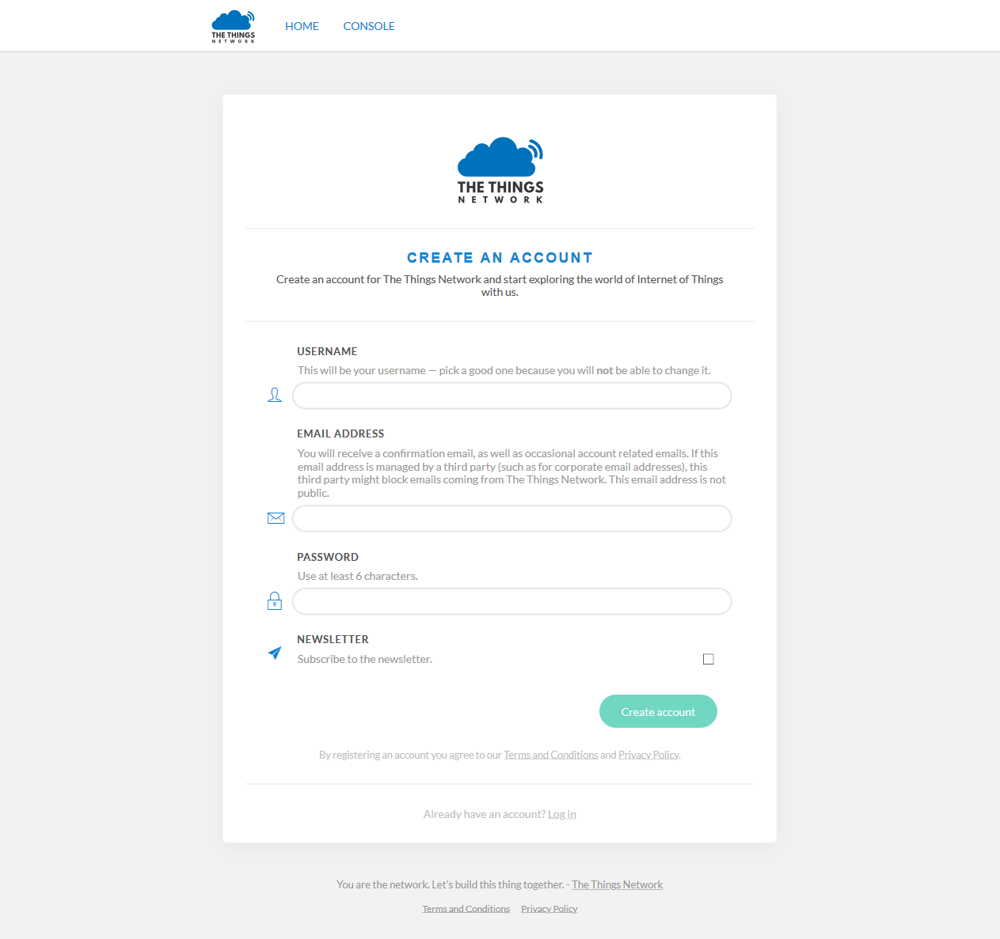

# LoRaWAN Node on The Things Network

> The LoRaWAN® specification is a Low Power, Wide Area (LPWA) networking protocol designed to wirelessly connect battery operated ‘things’ to the internet in regional, national or global networks, and targets key Internet of Things (IoT) requirements such as bi-directional communication, end-to-end security, mobility and localization services. - [Lora Alliance](https://lora-alliance.org/about-lorawan)

[The Things Network](https://www.thethingsnetwork.org/) is a project dedicated to building a open, free and decentralized internet of things network.

## Creating a The Things Network Account



To create a The Things Network Account navigate to https://www.thethingsnetwork.org/ and click on the "Sign up" button. After that you'll need to enter a username, email and password. Be sure to enter a good username since you won't be able to change it after creating the account. 

## Creating an application

Next you'll need to create an application. For this you can simply navigate to the application page and click "add application".


## Registering the Device at The Things Network

Now that you've created an application you're ready to register an device.


After adding the device go to the Settings tab and change the **Activation Method** to **ABP**.


Now you should see an device address, network session key and app session key under the Overview tab.These three values will later be needed to get the script to work.


## Install arduino-lmic

LMiC (formerly ‘LoRa MAC in C’) is IBM's LoRa library. Arduino-LMIC contains the IBM LMIC (LoraMAC-in-C) library, slightly modified to run in the Arduino environment, allowing using the SX1272, SX1276 tranceivers and compatible modules (such as some HopeRF RFM9x modules).

To install the library:
* go to **Sketch > Include Library > Manage Libraries** and search for lmic and install the **IBM LMIC Framework** library.

## Wiring RFM95 and ESP32


The RFM95 communicates with the microcontroller over [SPI](https://en.wikipedia.org/wiki/Serial_Peripheral_Interface). To get the module to communicate with the ESP32 correctly connect the pins as follows:

* GND: GND
* 3.3V: 3.3V
* MISO: D19
* MOSI: D23
* SCK: D18
* RESET/RST: D14
* DIO0: 2
* DIO1: 15
* DIO2: 4
* NSS: 5

Note: off the three GND pins only one needs to be connected.

If you are using the RFM Adapter from school you'll have to use the following image:


**Important**: Don't forget to connect an antenna to the ANT pin.

## Creating a sender script

The LMIC library already includes a script for The Things Network, which can be accessed under **Examples > IBM LMIC Framework > ttn**.

To get the script to work you have to enter the Network Session Key, App Session Key and Device Address from the Overview tab of the Device. You'll also have to update the **lmic_pinmap lmic_pins** variables depending on how you connected it to your microcontroller.

In my case I used the following pins:

```c
const lmic_pinmap lmic_pins = {
    .nss = 6,
    .rxtx = LMIC_UNUSED_PIN,
    .rst = 5,
    .dio = {2, 3, 4},
};
```

After running the file you should see something like the following in the Serial Monitor


You should now be able to see the send data in the **Data tab** of the Application or Device page.


