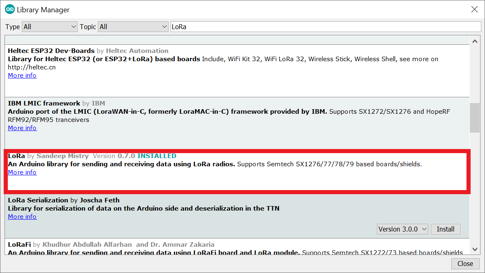
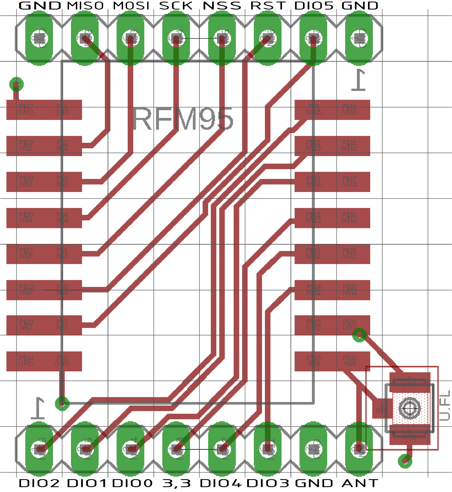
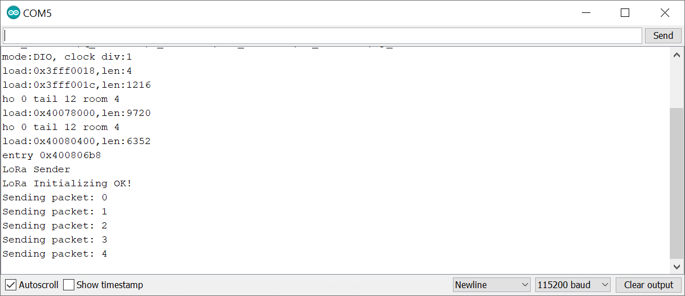
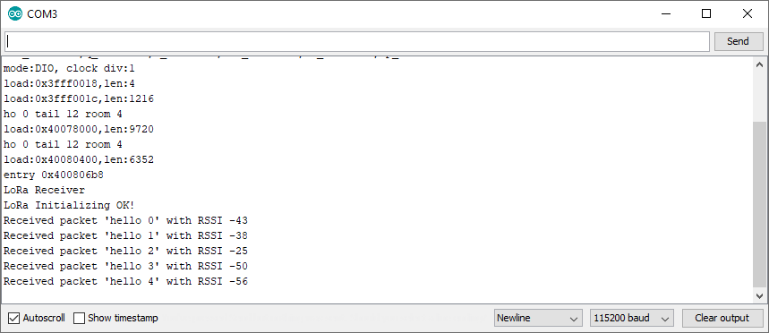

# LoRa (Long Range Wide Area Network)


## What is LoRa?

LoRa is a spread spectrum modulation technique derived from chirp spread spectrum (CSS) technology. LoRa allows for long-range, low power wireless communication, often applied in IoT (Internet of Things) applications.

## Different LoRa Frequencies

LoRa uses license-free radio frequency bands. The most widely used frequencies are:
* 868MHz in Europe
* 915MHz in Australia and North America
* 923MHz in Asia

## LoRa Applications

Because of its huge range and low power consumption LoRa can be widely applied in applications like:
* Internet of Things (IoT)
* Smart Home

## LoRa with ESP32 (Point to Point Communication)

Getting started with Lora is pretty straight forward. You only need two LoRa modules, like a [RFM95](https://at.rs-online.com/web/p/rf-module/1251259/), and two microcontrollers (ESP32 for this guide).

One of the two will play the sender. The other one will receive the messages and will react accordingly.

### Preparing the Arduino IDE

Before you can get started working with LoRa you need to install all the necessary add-ons needed to get the ESP32 and LoRa working in the Arduino IDE:

#### ESP32 support for the Arduino IDE

If you haven't already you'll need to install an add-on that allows you to program an ESP32 using the Arduino IDE. 

Guide:
[Installing the ESP32 Board in Arduino IDE (Windows, Mac OS X, Linux)](https://randomnerdtutorials.com/installing-the-esp32-board-in-arduino-ide-windows-instructions/)

#### Installing the LoRa Library

There are several libraries available that allow you to use LoRa with the ESP. For this guide, we'll use the [arduino-LoRa library](https://github.com/sandeepmistry/arduino-LoRa) created [by sandeepmistry](https://github.com/sandeepmistry/).

Open the Arduino IDE and go to **Sketch > Include Library > Manage Libraries** and search for **LoRa**. Scroll down until you find the right library and click install.



### Wiring RFM95 and ESP32

The RFM95 communicates with the microcontroller over [SPI](https://en.wikipedia.org/wiki/Serial_Peripheral_Interface). So you can simply connect the RFM95 to the default SPI pins of the ESP32 as shown in the following image:

<figure >
  
  <figcaption>From: https://randomnerdtutorials.com/esp32-lora-rfm95-transceiver-arduino-ide/</figcaption>
</figure>

**Note**: Of the 3 GND Pins, only one needs to be connected.

If you are using the RFM Adapter from school you'll have to use the following image:



**Important**: Don't forget to connect an antenna to the ANT pin.

### LoRa Sender Example Sketch

The LoRa library has a sender and receiver example script, which you can open by going to **File > Examples > LoRa > LoRaSender**. You will have to make a few little changes to get it to work:

```c
#include <SPI.h>
#include <LoRa.h>

#define ss 5
#define rst 14
#define dio0 2

int counter = 0;

void setup() {
  Serial.begin(9600);
  while (!Serial);

  Serial.println("LoRa Sender");

  LoRa.setPins(ss, rst, dio0);

  if (!LoRa.begin(866E6)) {
    Serial.println("Starting LoRa failed!");
    while (1);
  }
}

void loop() {
  Serial.print("Sending packet: ");
  Serial.println(counter);

  // send packet
  LoRa.beginPacket();
  LoRa.print("hello ");
  LoRa.print(counter);
  LoRa.endPacket();

  counter++;

  delay(5000);
}
```

Let's break this down piece by piece:

It starts by including the needed libraries.

```c
#include <SPI.h>
#include <LoRa.h>
```

Then, it defines the pins used by the LoRa module. If you've folled the schematic above, you should have the following pins:

```c
#define ss 5
#define rst 14
#define dio0 2
```

Now inside the setup method you can set the pins by calling the ```.setPins``` method. Afterwards, you can initialize the LoRa module by calling ```LoRa.begin(frequencey)```, passing it the right frequency for your location.

With the initialization done, you can send data using the following code:

```c
LoRa.beginPacket();
LoRa.print("hello ");
LoRa.print(counter);
LoRa.endPacket();
```

### LoRa Receiver Example Sketch

The receiver sketch is very similar to the sender sketch. The only differences are in the loop method, where instead of sending data, the script is receiving data.

```c
#include <SPI.h>
#include <LoRa.h>

#define ss 5
#define rst 14
#define dio0 2

void setup() {
  Serial.begin(9600);
  while (!Serial);

  Serial.println("LoRa Receiver");

  LoRa.setPins(ss, rst, dio0);

  if (!LoRa.begin(866E6)) {
    Serial.println("Starting LoRa failed!");
    while (1);
  }
}

void loop() {
  // try to parse packet
  int packetSize = LoRa.parsePacket();
  if (packetSize) {
    // received a packet
    Serial.print("Received packet '");

    // read packet
    while (LoRa.available()) {
      Serial.print((char)LoRa.read());
    }

    // print RSSI of packet
    Serial.print("' with RSSI ");
    Serial.println(LoRa.packetRssi());
  }
}
```

### Testing the Scripts

To test if everything is working correctly, you need to connect both ESPs to a PC and open the Serial Monitor.

The Lora Sender script should have the following output:



Output of the receiver scripts:



