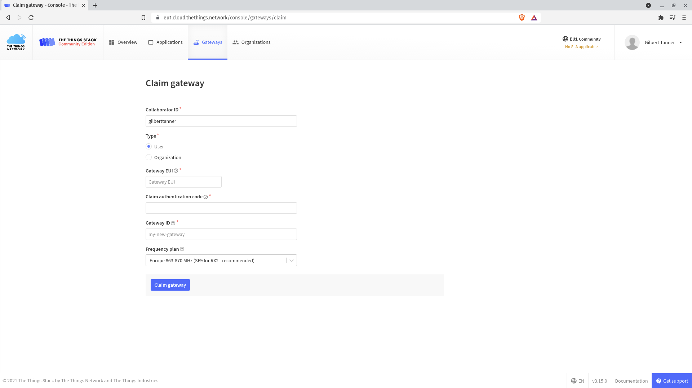
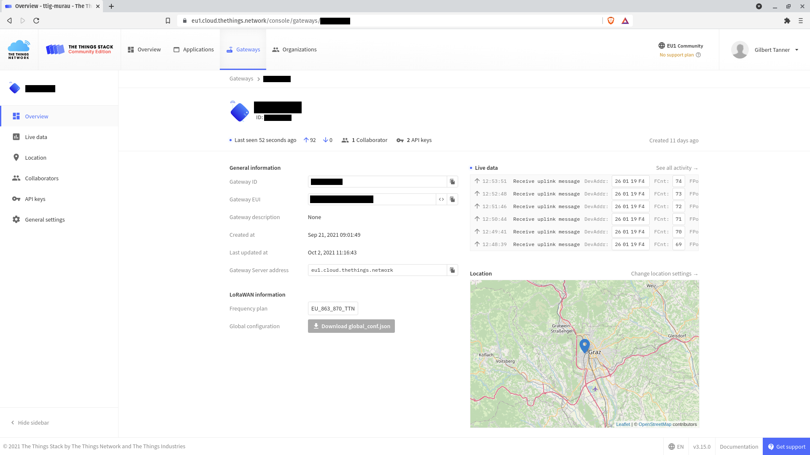
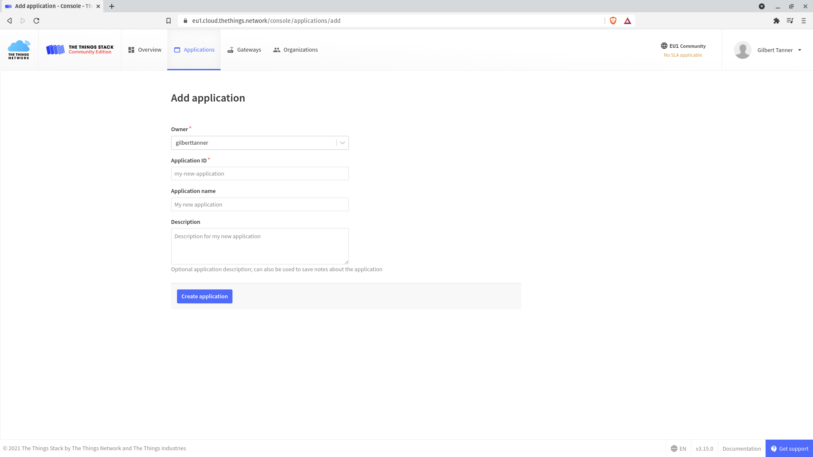
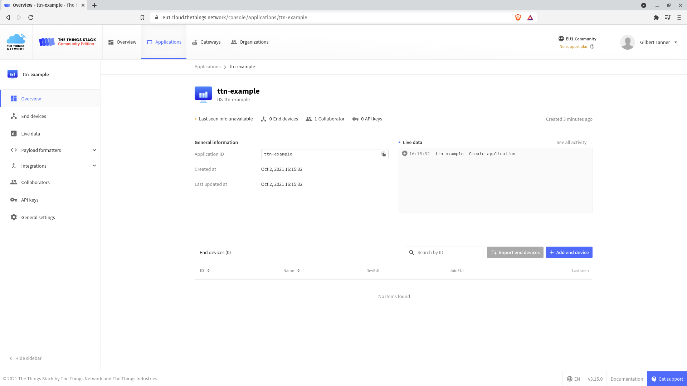

# LoRaWAN Node on The Things Network

> The LoRaWAN® specification is a Low Power, Wide Area (LPWA) networking protocol designed to wirelessly connect battery operated 'things' to the internet in regional, national or global networks, and targets key Internet of Things (IoT) requirements such as bi-directional communication, end-to-end security, mobility and localization services. - [Lora Alliance](https://lora-alliance.org/about-lorawan)

[The Things Network](https://www.thethingsnetwork.org/) is a project dedicated to building an open, free, and decentralized internet of things network.

## Creating a The Things Network Account


To create a The Things Network Account navigate to https://www.thethingsnetwork.org/ and click on the "Sign up" button. After that, you'll need to enter a username, email, and password. Be sure to enter a good username since you won't be able to change it after creating the account. 

## Adding a gateway

> Gateways form the bridge between devices and The Things Network. Devices use low power networks like LoRaWAN to connect to the Gateway, while the Gateway uses high bandwidth networks like WiFi, Ethernet or Cellular to connect to The Things Network. All gateways within reach of a device will receive the device’s messages and forward them to The Things Network. The network will deduplicate the messages and select the best gateway to forward any messages queued for downlink. A single gateway can serve thousands of devices. - [TTN Gateway documentation](https://www.thethingsnetwork.org/docs/gateways/)

If there already is a gateway within reach you won't need to buy one yourself since all gateways within reach of a device will receive and forward messages.

### The Things Indoor Gateway

For my tests I used the [The Things Indoor Gateway (TTIG)](https://www.thethingsindustries.com/docs/gateways/thethingsindoorgateway/), an 8 channel LoRaWAN gateway with LBT support, which is available for $69.


#### Buying The Things Indoor Gateway

**Links:**
* RS Components - [link](https://uk.rs-online.com/web/p/radio-frequency-development-kits/1843981/)
* Connected Things - [link](https://connectedthings.store/gb/lorawan-gateways/the-things-indoor-gateway-868-mhz.html)
* IoT Shop - DE - [link](https://iot-shop.de/produkt/the-things-indoor-gateway)
* Allied Electronics - [link](https://www.alliedelec.com/product/rs-components-uk/ttig-915/71600476/)

There are also lots of other gateways. For an extensive list check out the hardware section of the TTN [gateway documentation](https://www.thethingsindustries.com/docs/gateways/).

### Connecting the gateway to your WiFi (from the [TTN docs](https://www.thethingsindustries.com/docs/gateways/thethingsindoorgateway/#connecting-the-things-indoor-gateway))

1. Press the reset button (small button at the back of the gateway next to the USB-C port) for 5 seconds until the LED blinks rapidly GREEN<->RED for a couple of times.
2. Hold the SETUP (button at the top of the gateway, next to the LED) for 10 seconds until the LED blinks rapidly in RED.
3. The gateway now exposes a WiFi AP whose SSID is MINIHUB-xxxxxx where xxxxxx is the last 6 digits of the gateway ID.
4. The password for this network is printed on the back panel of the device under WiFi PW.
5. After connecting to this network go to 192.168.4.1 using a web browser to access the WiFi config page.
6. Select the WiFi network and enter the password if it’s a closed network.
7. Select the “Save and Reboot” option.
8. If your config is right,
    * The gateway will blink GREEN for a few seconds while it connects to this network.
    * Then, it will blink GREEN<->RED for a few seconds while it connects to the CUPS endpoint and fetches the necessary information to connect to the LNS traffic endpoint.
9. If your configuration was successful, the LED will be solid GREEN which means that the gateway is connected to the LoRaWAN network and is ready to handle packets.

### Connection to the TTN Backend

Now, that your gateway is connected to the LoraWAN network you can register it inside TTN. For this, navigate to the [**gateways** page](https://console.thethingsnetwork.org/gateways) and click "**Claim gateway**".


Fill in the **Gateway EUI**, the **Claim authentication code** (the WiFi Password on the back of your TTN Indoor Gateway), the **Gateway ID** and choose the appropriate Frequency Plan for your region and device. The EUI of the gateway is derived from the first number below the QR code on the back of the TTN Indoor Gateway. To get the 8 byte EUI insert FFFE after the first 6 characters. The EUI can also be found at the bottom of the WiFi Setup page.



After you're finished click the "**Claim gateway**" button. If your inputs are correct, a new gateway will be created and you'll be redirected to an gateway overview page, showing you some basic information about the gateway as well as the live traffic of the gateway.



If you don't have any nodes yet don't worry. You'll learn how to create an application and add a node in the next sections.

## Creating an application

To create an application go to **Applications** in the top menu, and click **Add Application** to get to the application registration page. Fill in the application id (all other fields are optional).



After clicking on the "**Create application**" button, you'll be redirected to the application overview page.



## Registering a device

Now that you've created an application you can add end devices to the application by going to **End devices** in the left menu and clicking on the "**Add end device**" button to reach the end device registration page.


After adding the device go to the Settings tab and change the **Activation Method** to **ABP**.


Now you should see a device address, network session key, and app session key under the Overview tab. These three values will later be needed to get the script to work.


## Install arduino-lmic

LMiC (formerly 'LoRa MAC in C') is IBM's LoRa library. Arduino-LMIC contains the IBM LMIC (LoraMAC-in-C) library, slightly modified to run in the Arduino environment, allowing using the SX1272, SX1276 transceivers and compatible modules (such as some HopeRF RFM9x modules).

To install the library:
* go to **Sketch > Include Library > Manage Libraries** and search for lmic and install the **IBM LMIC Framework** library.

## Wiring RFM95 and ESP32


The RFM95 communicates with the microcontroller over [SPI](https://en.wikipedia.org/wiki/Serial_Peripheral_Interface). To get the module to communicate with the ESP32 correctly connect the pins as follows:

* GND: GND
* 3.3V: 3.3V
* MISO: D19
* MOSI: D23
* SCK: D18
* RESET/RST: D14
* DIO0: 2
* DIO1: 15
* DIO2: 4
* NSS: 5

Note: Of the three GND pins, only one needs to be connected.

If you are using the RFM Adapter from school you'll have to use the following image:


**Important**: Don't forget to connect an antenna to the ANT pin.

## Creating a sender script

The LMIC library already includes a script for The Things Network, which can be accessed under **Examples > IBM LMIC Framework > ttn**.

To get the script to work, you have to enter the Network Session Key, App Session Key, and Device Address from the Overview tab of the Device. You'll also have to update the **lmic_pinmap lmic_pins** variables depending on how you connected it to your microcontroller.

In my case, I used the following pins:

```c
const lmic_pinmap lmic_pins = {
    .nss = 6,
    .rxtx = LMIC_UNUSED_PIN,
    .rst = 5,
    .dio = {2, 3, 4},
};
```

After running the file, you should see something like the following in the Serial Monitor


You should now be able to see the send data in the **Data tab** of the Application or Device page.


## Encoding/Decoding data

LoraWAN and TTN transfer raw bytes, which can be hard to read. That's the reason why libraries are provided to encode/decode data. For Arduino the [Lora Serialization library](https://github.com/thesolarnomad/lora-serialization) can be used. The library allows you to encode your data on the Arduino side and decode it on the TTN side.

If you for example have temperature, humidity, pressure and sea_leavel readings you can encode/decode your data as follows:

Arduino side:
```c
LoraMessage message;

message
    .addTemperature(temperature)
    .addHumidity(humidity)
    .addUnixtime(pressure)
    .addUint16(sea_level);
```

TTN side (Payload Formats):
```javascript
// copy the content from src/decoder.js (https://github.com/thesolarnomad/lora-serialization/blob/master/src/decoder.js)
function Decoder(bytes, port) {
  var json = decode(bytes, [temperature, humidity, unixtime, uint16], ['temperature', 'humidity', 'pressure', 'sea_level']);
  return json;
}
```


If you now look at the data tab you'll be able to see the data as decoded elements.


## Gateway data retrieval over MQTT

Now we are receiving the data in TTN, but how can we now get the data from TTN? TTN allows you to get the data over MQTT, an extremely lightweight machine-to-machine(M2M) connectivity protocol using a publish/subscribe model.

In the following examples, I'll show you how to receive data by using [Mosquitto's CLI](https://mosquitto.org/download/), but TTN also provides libraries for multiple programming languages, including Java, Node.js, and Python. For more information, check out the [SDKs & Libraries section in the documentation](https://www.thethingsnetwork.org/docs/applications/sdks.html).

### Receiving Messages (up)

To receive data from a TTN application, execute the following command:

```bash
mosquitto_sub -h <Region>.thethings.network -t '+/devices/+/up' -u '<AppID>' -P '<AppKey>' -v
```

> Don't forget to replace \<Region>, \<AppID>, \<AppKey> with the right values for your application. You can find them in the Overview tab of your application. The region is can be found under **Handler**. You will only need the part that follows **ttn-handler-**, e.g. **eu**.

> Note: ```-t``` stands for the topic do subscribe to. The topic has the following structure: ```AppID/devices/deviceID/up```. Attributes between // can also be replaced with a ```+```, which stands for everything. So if instead of a deviceID you put a ```+``` you'll listen to every device registered in the application.

If you only want to get a specific field you can write the name of the field after **up/**.

```bash
mosquitto_sub -h <Region>.thethings.network -t '+/devices/+/up/led' -u '<AppID>' -P '<AppKey>' -v
```

### Sending Messages (down)

MQTT can also be used to send messages to TTN. For this you will have to address a specific device by its **Device ID**.

```
mosquitto_pub -h <Region>.thethings.network -t "<AppID>/devices/<DevID>/down" -u "<AppID>" -P "<AppKey>" -m "{""payload_fields"":{""led"":true}}"
```